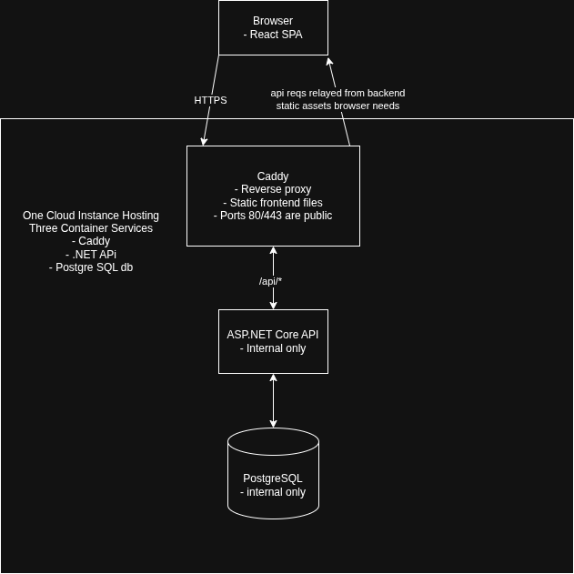
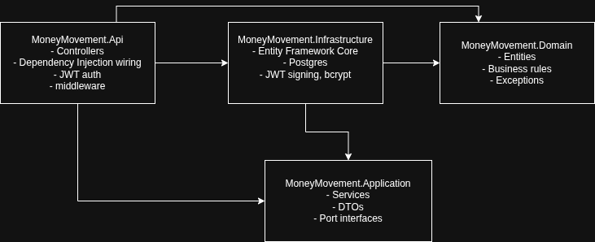

# MoneyFlow
This is a full-stack money movement simulator application built as a portfolio project and as proof of understanding of layered backend architecture (domain driven design), React for frontend and basic containerization deployment. 
Features include:
- Multiple accounts per users
- Transfers between users and accounts
- A basic fraud screening business logic tool, in which an external vendor can be used in place of
- Idempotency and Concurrency safe movement

**Stack**: ASP.NET Core 8 (C#) · PostgreSQL · React + Vite + MUI + Redux
Toolkit · Docker Compose · Caddy · Vultr

---

## Table of contents

- [High-level architecture](#high-level-architecture)
- [Backend: layered architecture](#backend-layered-architecture)
- [Backend: key design decisions](#backend-key-design-decisions)
- [Frontend architecture](#frontend-architecture)
- [Authentication](#authentication)
- [Deployment architecture](#deployment-architecture)
- [Local development](#local-development)
- [Known limitations](#known-limitations)

---

## High-level architecture



---

## Backend: layered architecture



Backend follows dependency inversion structure across four projects!


- **Domain**
  - No references to anything else
  - Defines Account, Transfer, User, Exceptions within business logic (DomainExceptions)
- **Application**
  - Defines interfaces it needs IAccountRepository, IUnitOfWork, etc. Does not know who implements them
  - DTOs that cross the API boundary
- **Infrastructure**
  - Implements interfaces against real systems
  - EF Core / Postgres for persistence, bcrypt for password hashing, JWT library for tokens
  - Only this project and API know these concrete technologies exist
- **Api**
  - Composition root
  - Wires concrete Infra implementations to interfaces Application declared using .NET Core DI container
  - Translates DomainExceptions into HTTP responses

---

## Backend: key design decisions

**Idempotent transfers**
- Each transfer req has a client-generated IdemptotencyKey
- TransferService checks for an existing transfer with the key, before creating a new one
- A unique db index on the column is the backstop against a race between two near-simultaneous identical reqs
- Returns original transfer instead of erroring

**Optimistic concurrency with bounded retries**
- Two transfers working on same account at once are caught via a Postgres row-version check. Account.Version is mapped to the 'xmin' system column
- A conflict retries the whole debit/credit operation up to 3 times (set manually) before failing the transfer

**Rule-based fraud screening**
- Flags a transfer for review if it exceeds a fixed amount of if sending account has made several transfers within a short window
- Flagged transfers do nothing until a reviewer approves or rejects it
- Currently no role for reviews/admins

**Rate limiting.** A global fixed-window limiter (100 req/min per IP) covers
the whole API; a much stricter one (5 req/min per IP) applies specifically to
`/api/auth/*`, since register/login are the only unauthenticated endpoints
and bcrypt hashing makes each attempt disproportionately expensive to allow
unlimited attempts against.
- 100 req/min per IP for the whole API
- 5 req/min for auth endpoints, since they are the only unauthenticated endpoints

---

## Frontend architecture

```
frontend/src/
├── api/          one file per backend controller 
├── store/        Redux Toolkit slices (auth, accounts, transfers).
│                 auth is persisted to localStorage via redux-persist;
│                 accounts/transfers are an in-memory session cache to
│                 avoid re-fetching on every tab switch
├── routes/       Route guards
├── theme/        MUI theme, Claude designed this part and visuals for the app.
├── components/   reusable UI: navbars, status displays, the landing hero
└── pages/        actual pages using the components
```

- JWT and decoded user claims are persisted upon refresh
- Balances, transfer history is not persisted, since it may update
- Everything clears on logout

---

## Authentication
- Passwords hashed with bcrypt (which apparently also salts it as well, very nice).
- Login/register, issued a JWT with the claims, signed with a key from the configuration
- Frontend stores token in Redux (localStorage) and attaches it as a Bearer header on every request via Axios interceptor
- ICurrentUser (interface in Application layer) is implemented in the API project specifically. (The only one in the codebase, because its an HTTP concept)
- Login failures are generic
---

## Local development

```bash
# Database
docker compose up -d               # starts Postgres only, for local dev

# Backend
cd backend
dotnet ef database update --project MoneyMovement.Infrastructure --startup-project MoneyMovement.Api
dotnet run --project MoneyMovement.Api

# Frontend
cd frontend
npm install
cp .env.example .env
npm run dev
```

The backend runs at `http://localhost:5080`, the frontend at
`http://localhost:5173` — CORS in `appsettings.json` is already configured
to allow that exact origin locally.

---

## Known limitations
- **No reviewer/admin role.** Any authenticated user can currently approve
  or reject any flagged transfer via `PATCH /api/transfers/{id}/review`,
  including their own
